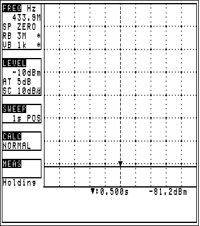

BK Precision 2650 Printer Emulator
======================

BK Precision 2650 is a handheld battery operated spectrum analyser, it has RS232 port connection for remote control and also for attaching PT 2650 printer. This utility emulates this printer and stores the screenshot as bitmap file on your computer.

Usage:
 - bkprinter.exe [serial port] [image name]

Example:
 - bkprinter.exe - automatically opens COM1: at 38400 baud and saves the screenshot as "screen.bmp"
 - bkprinter.exe COM3: - opens COM3 port and save screenshot as "screen.bmp"
 - bkprinter.exe COM3: test.bmp - saves the screenshot as "test.bmp"

The transfer takes about one minute. This is not a bug of this utility, the device just sends the data so slowly, probably the PT2650 printer has too small RAM memory for caching the serial traffic.

All source code is placed in a single file (bkprint.cpp) and should be built with Visual Studio 2005/2008/2010. The project file (bkprint.sln) can be opened in Visual studio 2010.

In folder "release", you can find compiled executable.

Screenshot:
======================

Gabriel Valky, 2013