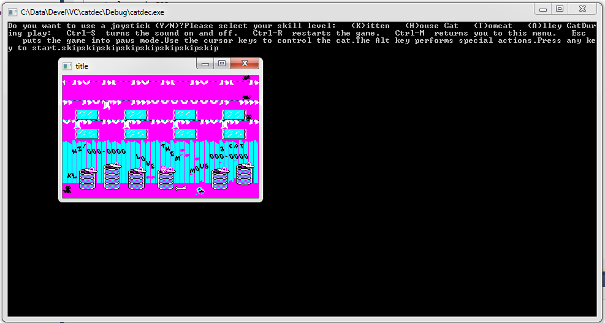

Alley cat
==========

[This game](http://en.wikipedia.org/wiki/Alley_Cat_%28video_game%29) was created in 1984 and now, after 30 years I am trying to convert it to modern computer platforms. My idea was porting this game at first into C++ and then to javascript, so that it could be played in any web browser without using a DOS emulator.
For obtaining the assembler source code I used IDA disassembler. The utility "AsmToC" converts 16 bit assembler instructions line by line into C code, about 95% of the conversion is done by this utility, however some conditional jumps need to be fixed manually. The converter puts a breakpoint in every point of code where it wasn't sure what to do. Main code of game is placed in Game folder. This program is designed to be compiled in Visual Studio and emulates the CGA graphic adapter, PC speaker, timers and keyboard. This project is still not finished and the game is not playable, but the cat can be moved by arrow keys :)

Here is a link to converted game into javascript running directly in your web browser: [AlleyCat.html](https://rawgithub.com/gabonator/Work-in-progress/master/AlleyCat/Javascript/alleycat.html)

And here is the intro animation running in Mozilla browser. Only the routines necessary to run the intro were converted but the browser hangs in a few moments after starting, probably because of some infinite loop. Unfortunately the browser is unable to break the code execution and debugging is thus too complicated. But for demonstration purposes this is sufficient. So any old 16 bit old DOS game can be converted into javascript and played without x86 emulator :)

