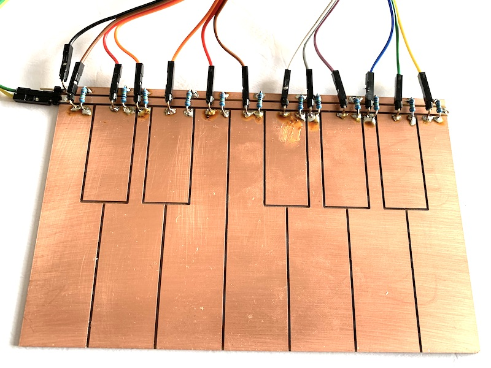
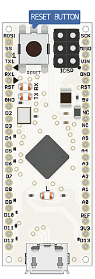
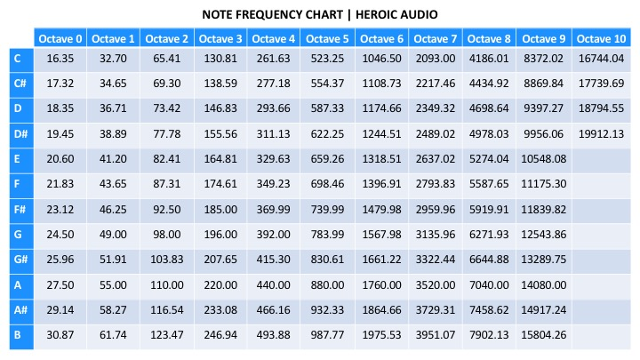
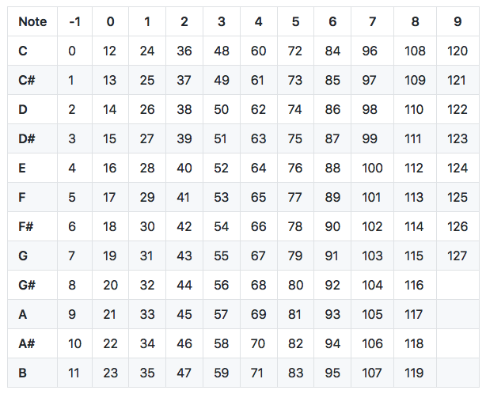
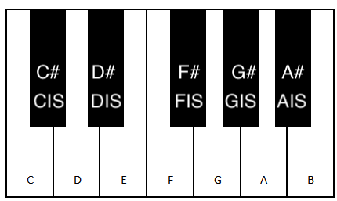
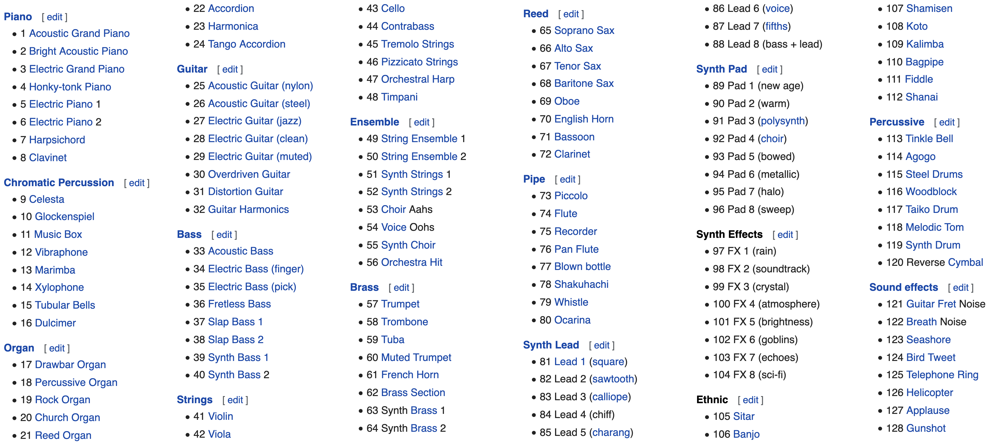

# DIY klavir



## U0: Prvy ton

 

 - pouzit vstavanu ukazku blink (Arduino -> File -> Examples -> 01. Basics -> Blink)
 - pouzit pin 12 (alebo 13 - interna LED) a pin GND
 - perioda obdlznikoveho signalu T = Ton + Toff
 - perioda T [s, sekundy], frekvencia f [Hz, hertz, kmity za sekundu], f = 1/T, T = 1/f


## U1: A440 

  

  - upravit program z U0 aby zahral ton 440 Hz
  - pouzit delayMicroseconds(n) namiesto (n)
  - 1 s = 1000 ms = 1000000 us

    ```c
    void setup() 
    {
      pinMode(12, OUTPUT);
    }

    /*
     *  A4
     *  f = 440Hz
     *  T = ? s
     *  T = ? ms
     *  T = ? us
     *  Ton = Toff = ? us
     */

    void loop() 
    {
      digitalWrite(12, HIGH);
      delayMicroseconds(?);
      digitalWrite(12, LOW);
      delayMicroseconds(?);
    }
    ```

## U2: Funkcia tone a noTone

  - pouzit funkciu tone(pin, frekvencia), a noTone(pin)

## U3: Akord

  - zahrat akord

    ```c
    void setup()
    {
    }

    /*
     *  C dur = ? ? ?
     *  
     *  ?6 = ? Hz
     *  ?6 = ? Hz
     *  ?6 = ? Hz
     */

    void loop() 
    {  
      tone(12, ?);
      delay(200);
      tone(12, ?);
      delay(200);
      tone(12, ?);
      delay(200);
      noTone(12);
      delay(5000);
    }
    ```

## U4: Melodia

  

  

  

  - http://L.valky.eu/klavirgen

## U5: Midi melodia

  - upravit predosly program aby namiesto pieza pouzival MIDI

    ```c
    void setup()
    {
      Serial1.begin(31250);
    }

    void NoteOn(int note)
    {
      Serial.write(?);
      Serial.write(?);
      Serial.write(?);
    }

    void NoteOff(int note)
    {                                                                                                                                                               \\\\\\\\\\\\\\\\\\
      Serial.write(?);
      Serial.write(?);
      Serial.write(?);
    }
    ```

  - NoteOn: kanal 0x90..0x9F, pitch 0..127, velocity 0..127
  - NoteOff: kanal 0x80..0x8F, Pitch 0..127, Velocity 0..127
  - Program change: Kanal 0xC0..0xCF, Cislo nastroja (0=Grand piano)
  
  
  - riesenie [predoslej ulohy](ArduinoTasks/U04-melodyPiezo.ino)
  - Middle-A note over MIDI channel 3 with a velocity of 79: 93-45-4F (hex)
  - Middle-C note over MIDI channel 10 with a velocity of 127: 9A-48-7F (hex)
  - Bass Drum 1 with a velocity of 79: 99-24-4F (hex)
  - High Bongo with a velocity of 127: 99-3C-7F (hex)
  - 0x90 - 0x40 - 0x40 (Start of E3 note, pitch=64)
  - 0x90 - 0x43 - 0x40 (Start of G3 note, pitch=67)
  - 0x80 - 0x43 - 0x00 (End of G3 note, pitch=67)
  - 0x80 - 0x45 - 0x00 (End of A3 note, pitch=69)
  - 0xC0 - 0x41 (channel 0, Alto Sax = 66 ==> coded 65 = 0x41)
  - 0xC1 - 0x00 (channel 1, Piano = 1 ==> coded 0)
  - 0xC9 - 0x00 (channel 9, Standard Drums Kit = 1 ==> coded 0)

## U6: USB Midi melodia

  - pridat include MIDIUSB.h

    ```c
    #include "MIDIUSB.h"

    void setup()
    {
    }

    void NoteOn(int note)
    {
      int channel = 0;
      int velocity = 127;

      midiEventPacket_t noteOn = {0x09, 0x90 | channel, note, velocity};
      MidiUSB.sendMIDI(noteOn);
      MidiUSB.flush();
    }

    void NoteOff(int note)
    {
      int channel = 0;
      int velocity = 127;

      midiEventPacket_t noteOff = {0x08, 0x80 | channel, note, velocity};
      MidiUSB.sendMIDI(noteOff);
      MidiUSB.flush();
    }
    ```
  - [virtual piano](https://recursivearts.com/virtual-piano/)
  - [online multiplayer piano](http://www.multiplayerpiano.com)
  - [piano trainer](https://pianu.com/intro/ode-to-joy)

## U7: Knizinca CapacitiveSensor

  - nainstalovat kniznicu CapacitiveSensor
  - otvorit ukazku

    ```c
    #include <CapacitiveSensor.h>

    // 4 - send pin, 2 - sensor pin
    CapacitiveSensor cs = CapacitiveSensor(4, 2);

    void setup()
    {
       cs.set_CS_AutocaL_Millis(0xFFFFFFFF);
       Serial.begin(9600);
    }

    void loop()
    {
        long start = millis();
        long measure = cs.capacitiveSensor(30);

        Serial.print(millis() - start); // kolko ms trvalo meranie?
        Serial.print("\t"); // tabulator
        Serial.print(measure); // vysledok
        Serial.print("\n"); // novy riadok
        delay(100);
    }
    ```

## U8: Trigger

  - capacitiveSensorRaw namiesto capacitiveSensor
  - globalna premenna

    ```c
    int bolZapnuty = 0;
    
    void update()
    {
      int jeZapnuty = ...;

      if (bolZapnuty == 0 && jeZapnuty == 1)
      {
        Serial.print("On\n");
        jeZapnuty = 1;
      }
      if (bolZapnuty == 1 && jeZapnuty == 0)
      {
        Serial.print("Off\n");
        jeZapnuty = 0;
      }
    }
    ```

## U09: Styri klavesy C, D, E, F

  - rozsirit program na styri nezavisle senzory
  - hrat tony s piezom
  - zahrat kohutik jarabi
  - bezpecne piny: 2, 3, 5, 7, 8, 10, 11, 12, A0, A1, A2, A3, A5

## U10: Cela oktava

  - rozsirit program na celu oktavu
  - hrat tony s piezom

## U11: MIDI Klavesy

  - cez uart ako v ulohe U5

## U12: USB MIDI klavesy

  - midi usb

## U13: Piano network
 
  - TX pin prepojeny na RX pin susedneho klavira
  - kazdy si zvoli svoju oktavu

    ```c
    void Preposli()
    {
      while (Serial1.available())
        Serial1.write(Serial1.read());
    }
    ```

## Extra
  - chord: hrat cely durovy akord podla root noty
  - layer: nastavit kanal 0 na piano a kanal 1 na strings (instrument c. 49), hrat na oboch naraz
  - zahrat na SAM2695 syntezatore
  - hrat bicie (treba kazdej klavese priradit spravny pitch: bass drum, snare, closed hi-hat, open hi-hat, crash)

    ```c
    // DREAM SAM2695 synthesizer

    DreamControl(0x3707, 127);

    void DreamControl(word command, byte value)
    {
      Serial1.write(0xb0);
      Serial1.write(0x63); 
      Serial1.write(command >> 8); // NRPN high = 0x37
      Serial1.write(0xb0);
      Serial1.write(0x62); 
      Serial1.write(command & 0xff); // NRPN low = 0x07
      Serial1.write(0xb0);
      Serial1.write(0x06); 
      Serial1.write(value); // NRPN value = 127  
    }

    void SetInstrument(byte channel, byte i) 
    {
      Serial1.write(0xC0 | channel);
      Serial1.write(i);
    }
    ```
