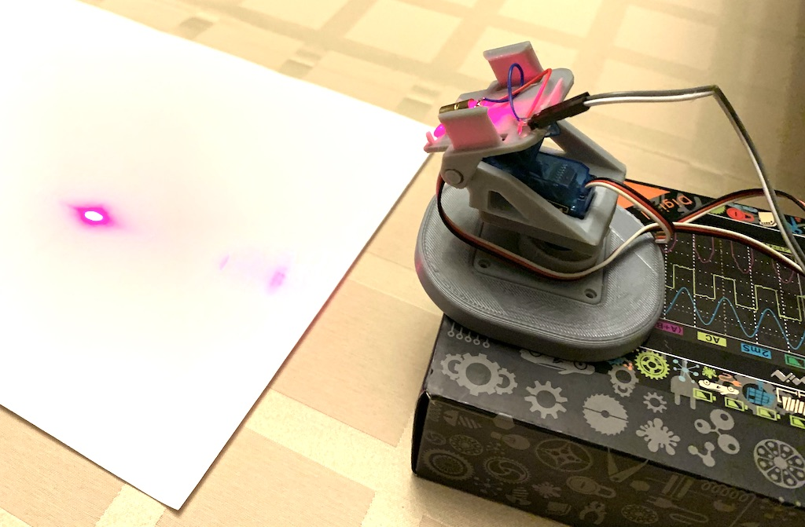

# Servomotory a pan-tilt podstavec

## Annotation 

arduino workshop: potenciometer a servo motor

Na tomto workshope si vysvetlime vnutornu konstrukciu potenciometra a modelarskeho servo motora 9g s riadenim so spatnou vazbou. Naucime sa, ako vyuzivat vstupne analogove piny na meranie napatia, a ako naskalovat vysledok analogovo digitalnej konverzie na lubovolny ciselny interval s pomocou linearnej interpolacie.

S pomocou pripravku vytlaceneho na 3d tlaciarni osadeneho dvomi servo motormi sa naucime vychylovat laserovy luc v priestore a premietnuty bod budeme pohybovat takym sposobom, aby na tienidle opisoval tvar niektorych pismen. 

Treba priniest: pocitac s Arduino Uno, USB-B kabel, harok papiera A4, pero

Na co sa mozete pripravit: programovanie Arduino Uno, linearna interpolacia y=y0+(x-x0)*(y1-y0)/(x1-x0), parametricke vyjadrenie usecky, pohyb po kruznici s harmonickymi funkciami sinus a kosinus, casovaci diagram ovladania servo motora

## BOM
Pre 8 ucastnikov

| polozka (vypocet poctu kusov a baleni) | pocet baleni | cena balenia | linka |
| -------------------------------------- | ------------ | ------------ | ----- |
| arduino uno (8 * 1 kus) | 8x | 8.80 | https://www.gme.sk/klon-arduino-uno-r3-atmega328p-ch340-mini-usb |
| servo motor 9g | 16x | 4.59 | https://www.gme.sk/servomotor-9g |
| laser | 8x | 2.56 | https://www.gme.sk/modul-s-cervenym-laserom-650nm-5mw |
| potenciometer piher linearny 10k | 8x | 1.22 | https://www.gme.sk/pc16mlk010 |
| kable (8 * 10 kablov, balenie po 40, 8 * 10 / 40) | 2x | 3.9 | https://www.gme.sk/propojovaci-vodice-zasuvka-zasuvka-40-kusu |
| lista rovna (8 * 19, 8 * 19 / 40) | 4x | 0.24 | https://www.gme.sk/oboustranny-kolik-s1g40-2-54mm
| lista lomena (8 * 15, 8 * 15 / 40) | 3x | 0.31 | https://www.gme.sk/oboustranny-kolik-s1g40w-2-54mm |

  - Rozpocet: 8 * 8.80 + 16 * 4.59 + 8 * 2.56 + 8 * 1.22 + 2 * 3.9 + 4 * 0.24 + 3 * 0.31 = 183.77 eur
  - Extra: obosjtranna paska, noznice, podlozky aspon 5cm, 8x pan tilt podstavce
  - Extra: papier A4, fixka, USB-A kabel

## Prezentacia

- [Prezentacia PDF](prezentacia.pdf)
- [Navod pre studentov](student.md)
- [Riesenia uloh](tasks/)

### Potenciometer
  - S2: konstrukcia potenciomatra
  - S3: nahradna schema potenciometra, delic napatia
  - S4/U0: Nakonfigurovanie prostredia arduino, zletovane potenciometra s pin headerom, vyskusat analogRead, pricom potenciometer je zasunuty priamo do arduina. Treba nastavit susedne piny na 0V a 5V
  - S5/U1: Celociselna aritmetika, ako predist overflovu, kedy pouzivat desatinne cisla
  - S6/U1: Celociselne typy v arduine, nativny typ INT, stdint
  - S7/U1: Ako fixnut pretecenia, ako pretypovat numericke typy
  - S8/U1.5: prepocet hodnoty z ADC na napatie vo voltoch
  - S9/U2: linearna interpolacia, upravit rozsah adc na iny interval a interval s offsetom
  - S10/U3: podmienky if/else, globalna premenna, porovnanie cisel, negacia podmienky
  - S11: linearna interpolacia, hadame vyznam koeficientov
  - S12: linearna interpolacia

### Servo & potenciometer
  - S13: konstrukcia serva
  - S14: riadenie serva, casovaci diagram
  - S15: spajkovanie spojok, aby sme nemuseli pouzit kontaktne pole
  - S16/U4: manualne generovanie riadiaceho signalu, nastavit strednu polohu serva
  - S17/U5: potenciometrom ovladat servo v plnom rozsahu 1000us..2000us, ADC vracia hodnotu 0..1024, mozeme pripocitat 1000 a mame sirku pulzu

### Servo
  - S18/U6: kniznica servo
  - S19: schema zapojenia dvoch serv + laser
  - S20/U7: karteziansky suradnicovy syystem, hladanie rohov papiera
  - S21/U8: axis-aligned pismena: I, L, T, F, E, H
  - S22/U9: problem s diagonalnym pohybom a riadenim rychlosti
  - S23/U10: kontrolovany diagonalny pohyb na 100 krokov, pouzit kod z materialov, doplnit iba interpolaciu
  - S24/U11: funkcia ciara, nakreslit pismena M, A, X, Y, pouzit kod z materialov
  - S25/U12: struktury a polia, upravit predosly kod s pouzitim struktury, pole bez specifikacie dlzky, volanie funkcie ciara
  - S26/U13: kruh, vysvetlit funkcie sin/cos podla https://www.geogebra.org/m/cNEtsbvC
  - S27/U13: kruh, funkcie sin cos, argument v radianoch, preco

## Zaver
  - pridat 3d modely ku pan-tilt podstavcom

