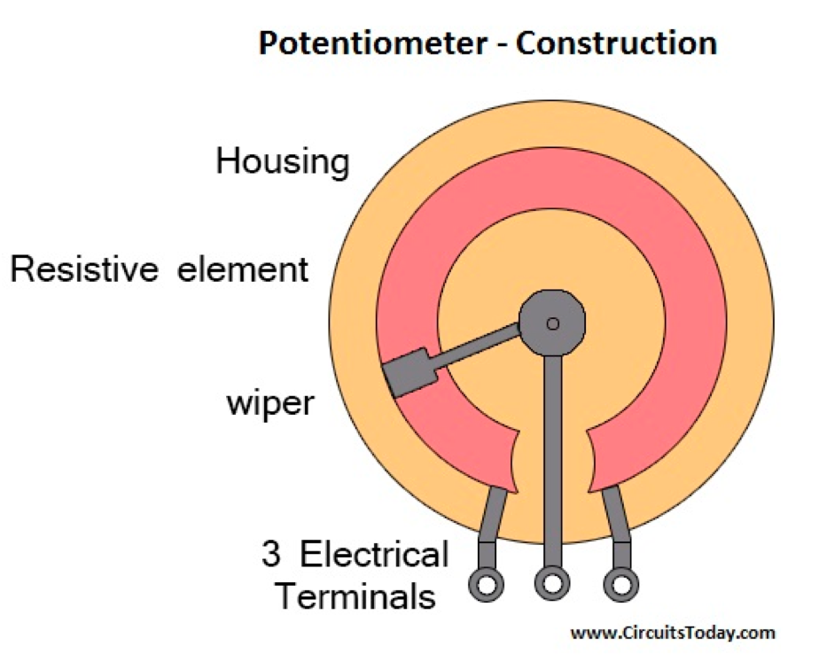
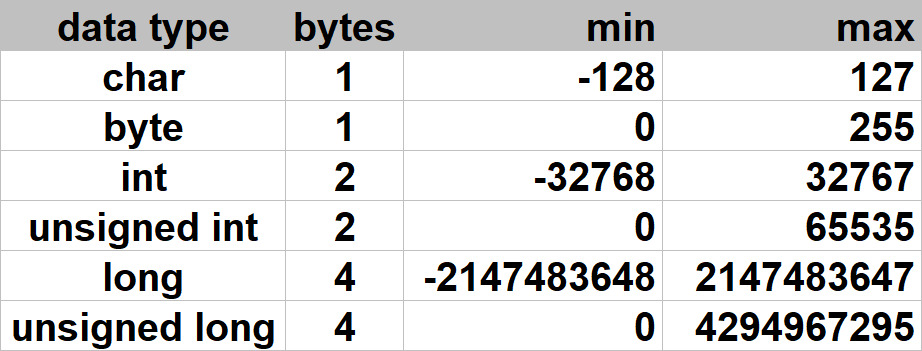
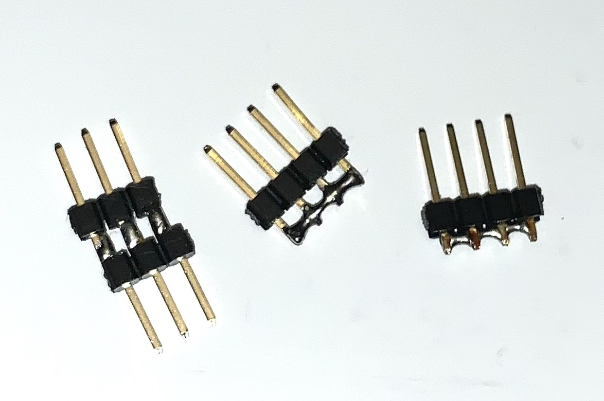
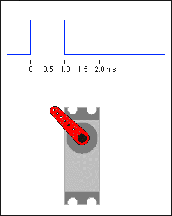
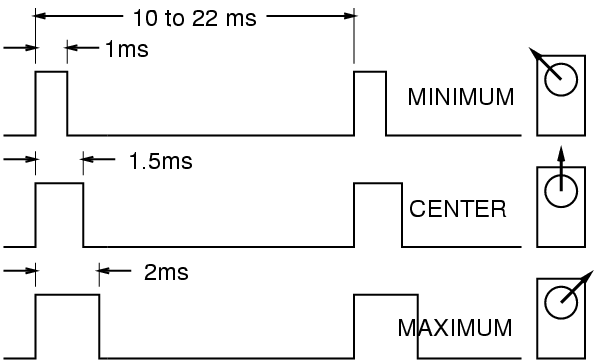
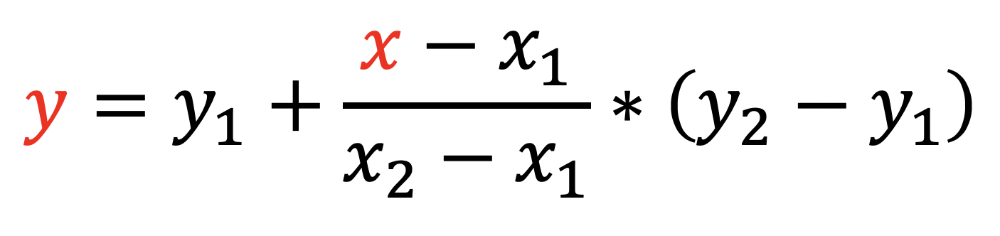
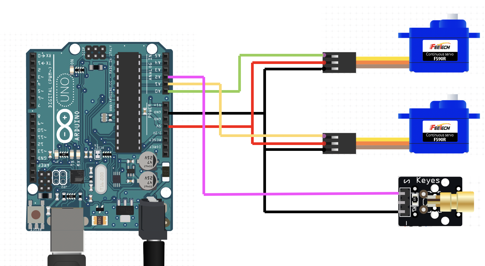

# Servomotory a pan-tilt podstavec

[Popis workshopu a riesenia uloh](readme.md)

## U0:



## U1:

Datove typy v arduine:


Ako predist overflowu:

  ```c
  Serial.print((long)1000*1000);
  Serial.print(1000L*1000);
  Serial.print(1000UL*1000);

  Serial.print((float)500*5/1000);
  Serial.print(500.0f*5/1000);
  ```

## U3:

Podmienky v C/C++:

  ```c
  if (podmienka)
  {
    // podmienka je pravdiva
  }

  if (a == b)
  {
    // a je zhodne s b
  } else
  {
    // a nie je zhodne s b
  }

  if (a != b)
  {
    // a nie je zhodne s b
  } else
  {
    // a je zhodne s b
  }

  if (!(a == b))
  {
    // a nie je zhodne s b
  }
  ```

## U4:



Ovladanie serva - animacia



Ovladanie serva - casovaci diagram




  ```c
  delayMicroseconds(us);
  delay(ms);

  // 1 s (sekunda) = 1000 ms (milisekund)
  // 1 ms (milisekunda) = 1000 us (mikrosekund)
  ```


## U5:

Linearna interpoalcia:




    k = (x-x1)/(x2-x1)
    y = y1 + k*(y2-y1)

    x - vstupna premenna je rozsahu x1..x2
    y - vystupna premenna bude v rozsahu y1..y2
    Ak je x v zaciatocnej hranici intervalu x=x1, tak k=0, cize y=y1
    Ak je x v koncovej hranici intervalu x=x2, tak k=1, cize y=y2

Schema zapojenia:



## U10:

  ```c
  #include <Servo.h>

  Servo servoX;
  Servo servoY;

  void setup()
  {
    servoX.attach(A0);
    servoY.attach(A1);
  }

  void loop()
  {
    for (int i=0; i<=100; i++)
    {
      // i = 0, 1, 2, 3 ... 98, 99, 100
      
      int x = ??? + i*???/???;
      int y = ??? + i*???/???;
      
      servoX.write(x);
      servoY.write(y);
      delay(10); // 100*10ms = 1s
    }
  }
  ```

## U11:

  ```c
  void ciara(int x1, int y1, int x2, int y2)
  {
    int dlzka = sqrt((x2-x1)*(x2-x1)+(y2-y1)*(y2-y1));
    for (int i=0; i<dlzka; i++)
    {
       int x = x1 + (x2-x1)*i/dlzka;
       int y = y1 + (y2-y1)*i/dlzka;
       servoX.write(x);
       servoY.write(y);
       delay(20);
    }
  }
  ```

## U12:

  ```c
  #include <Servo.h>
  Servo servoX, servoY;

  /*
   *    40,110        75,110
   * 
   * 
   * 
   *    10,70         67,120
   */

  void setup()
  {
    servoX.attach(A1);
    servoY.attach(A0);
  }

  void ciara(int x1, int y1, int x2, int y2)
  {
    int dlzka = sqrt((x2-x1)*(x2-x1)+(y2-y1)*(y2-y1));
    for (int i=0; i<dlzka; i++)
    {
       int x = x1 + (x2-x1)*i/dlzka;
       int y = y1 + (y2-y1)*i/dlzka;
       servoX.write(x);
       servoY.write(y);
       delay(20);
    }
  }

   /*
    *  pismeno A
    *          C.  57,110
    *  
    *  33,90  /   \   88,88        - 40, 100, 80, 100
    *       B. ___ D.
    *      /          \ 
    *   A.             E.
    *   10,70          120,67
    * 
    */

  struct bod {
    int x, y;
  };

  bod A{10, 70}, B{50, 95}, C{65, 110}, D{80, 95}, E{120, 67};
  bod ciary[] = {A, B, C, D, E, D, B, A};
    
  void loop()
  {
    int pocet = sizeof(ciary)/sizeof(ciary[0]);
    for (int i=0; i<pocet-1; i++)
    {
      ciara(ciary[i].x, ciary[i].y, ciary[i+1].x, ciary[i+1].y);
    }
    delay(1000);
  }
  ```

U13:

  - [Visualizacia geoniometrickych funkcii](https://www.geogebra.org/m/cNEtsbvC)
