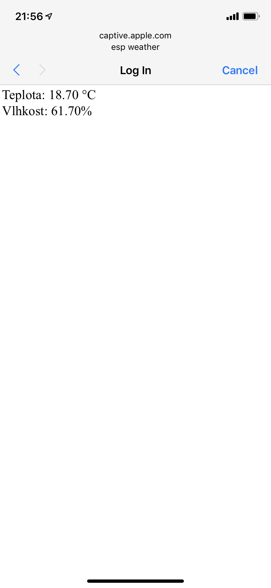
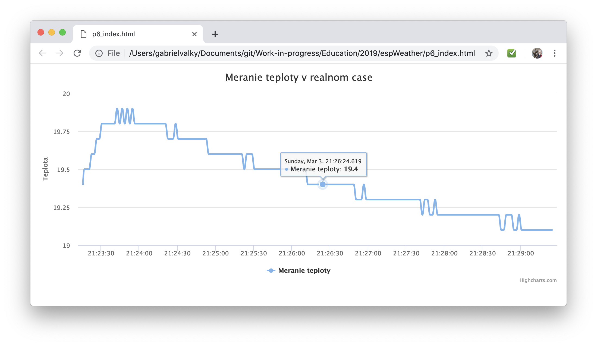

# Wifi Weather Station

## Brief
Simple weather station running on ESP8266 in soft access point mode. Automatically refreshing web interface reports temperature and humidity reading.

## Lecture 
 0. Install arduino
 1. Install ESP8266 board support in arduino [tutorial](https://randomnerdtutorials.com/how-to-install-esp8266-board-arduino-ide/)
 2. Install USB driver (TBD)
 3. (p0) Blink example (Examples -> 01. Basics -> Blink), setup/loop explanation
 4. Install DHT22 library (Sketch -> Include library -> Manage libraries -> DHT_sensor_library_for_ESPx)
 5. [Device brief](https://escapequotes.net/esp8266-wemos-d1-mini-pins-and-diagram/), Schematic (TBD), common power signal naming (GND, VCC, 5V), board pinout (5V G D4)
 6. (p1) DHT22 lib - serial console (baudrate)
 7. (p2) Simple web server
 8. (p3) Simple web server incl. dht
 9. (p4) SoftAP simple web server incl. dht
 10. (p5) SoftAP + DNS + Captive portal
 11. (p6) Bonus: Client + Realtime graph

## Bill of material
 
| a\* | b\* | item               | supplier | price |
|-----|-----|--------------------|----------|-------|
| x   |     | USB cable          |          |       |
| x   |     | Soldering tools    |          |       |
|     |  x  | Wemos D1 mini      | [gme.sk](https://www.gme.sk/nodemcu-lua-d1-mini-wifi-esp-12f-modul-s-esp8266) | € 7,47 |
|     |  x  | Dupont cable F-F (5-20pcs) | [gme.sk](https://www.gme.sk/propojovaci-vodice-zasuvka-zasuvka-40-kusu) |  € 3,89 * 0.5 |
|     |  x  | Pin header (20pcs) | [gme.sk](https://www.gme.sk/oboustranny-kolik-s1g40-2-54mm) | € 0,350 * 0.5 |
|     |  x  | DHT22 / AM2302     | [gme.sk](https://www.gme.sk/digitalny-teplomer-a-vlhkomer-s-dht22) | € 7,43 \*\* |
|     |     | dokopy             |          | € 17.02 |
- \* a - ostava na sklade
- \* b - spotrebny tovar
- \*\* predrazene, treba skontrolovat inych dodavatelov, realna cena 4 e
  
## BOZP
Soldering - Safety glasses
 
 
## Pictures

## Notes

- toto je iba koncept
- spisat navod na jednu A4 so vsetkym co bude potrebne
- uloh je viac, pocitam s tym, ze bonusovu nestihneme, ale ucastnici maju motivaciu sa doma dalej hrat
- prednaska pokryva: praca s Arduino IDE, praca s hardwarovymi datasheetmi, jednoduche programovanie v C++, zaklady HTML, praca so senzormi
- treba nakreslit schemu zapojenia (v podstate iba tri vodice spajajuce ESP a DHT22)
- gme.sk pokryva vsetky nase potreby aj ked pri vyssej cene