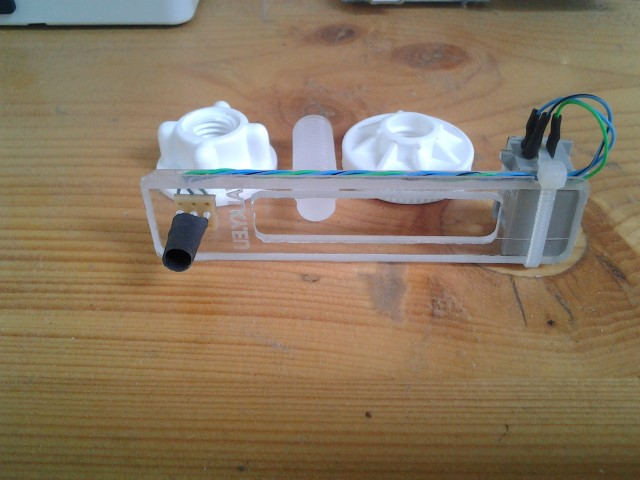

This device allows you to measure the power consumption of your house. Sensor attaches to the power meter by the double sided adhesive tape and observes the indication LED by photoresistor. Signal from this device is afterwards processed by central unit and pulse count is uploaded to a server script using GSM module. This script calculates the current consumption rate as well as total daily power consumption using the known pulse count ratio per 1 kWh.

Experimental setup, with realtime update of current power consumption rate

The sensor attached to power meter, the label says the impulse / power rate is 1800 pulses per 1kWh

Final device with cables and sensor

Disassembled contents of the box

Detail of sensor

