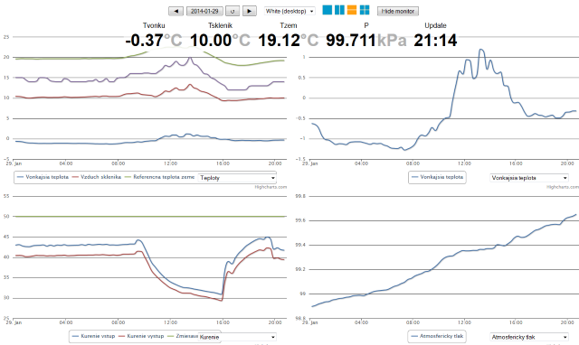
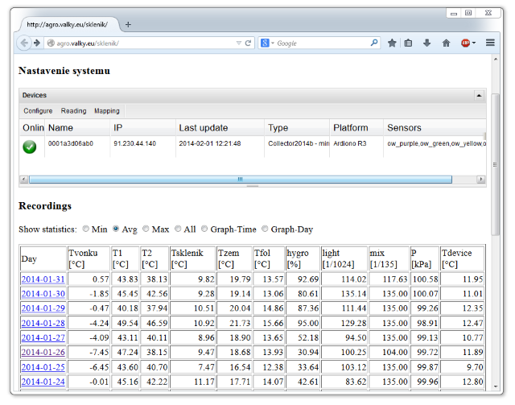
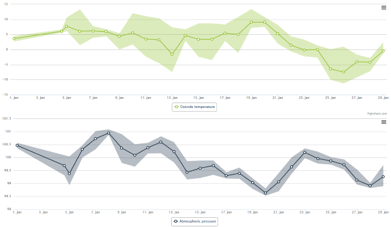

This is a new version of greenhouse monitoring system, you can read more here:
http://valky.eu/?data/research/elitech2013.txt

Live running application can be found here (only read-only mirror, does not support remote control of heating):
http://agro.valky.eu/sklenik/

Daily chart

Manager shows the device status and statistics for every day of measurement (minimum, maximum and average values)

Chart showing the average temeperature observed over whole month with min-max ranges

