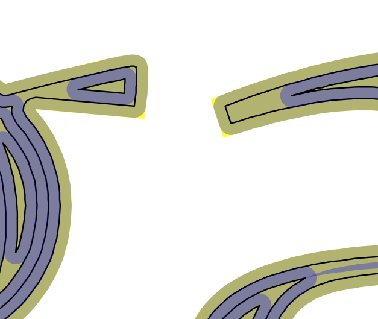
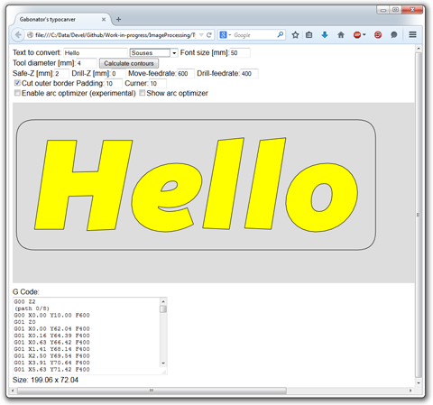

CNC Typocarver
==========

[Try it here](https://rawgit.com/gabonator/Work-in-progress/master/ImageProcessing/TypoCnc/typo.html)

Engraving single line letters with CNC is pretty simple task. But what if we want to engrave some bold text? At first we would engrave the outline of each letter and then considering the diameter of the engraving tool, we would engrave the inner parts of the letter. We would continue engraving until there are no untouched places inside. This can be done manually, or using Polygon Offset tool in Adobe Illustrator or other software. But I wanted to somehow automate this process, so I would just design the wanted text and use some utility that will calculate optimal paths for chosen drill tool diameter.

This script transforms SVG shapes into series of paths which can be used for engraving bold letters by CNC machine. What is missing is the final conversion of XY paths into G code and optimization with arcs. 

Keywords: cnc labels, cnc text, cnc truetype font, gcode, g code, carving labels with cnc, thick labels, bold text

Script implements these features:
- custom SVG parser
- SVG to XY path converter
- Path expanding, contour calculation - using Angus Johnson's [Javascript Clipper](http://sourceforge.net/projects/jsclipper/)
- Rendering paths using SVG element
- Export to G-code
- User interface for entering text, font, size and drill diameter with realtime rendering - Using [opentype.js](http://nodebox.github.io/opentype.js/)
- User interface for configuring the depth of drilling / multiple passes drilling
- Optimization of polylines to lines and arcs (experimental, need to be improved)
- Multiple fonts
- Cutting rectangle

Task list:
- Optimization of shapes order
- Custom dept

The target shape (gabo) is shown in yellow. You can only see it as light brown because it is covered with semitransparent blue lines representing the path a CNC drill 
will cut. Where multiple paths are overlapping, we can see blue lines. Black lines are the final calculated paths for CNC drill.

Yellow edges: Because of the diameter of the drill tool, some sharp parts of the SVG shape cannot be cut.

Result - on the yellow sheet I was having problems with acrylic melting caused by drilling too deep, on the black I broke the drill bit on letter g

This is how the application looks like
