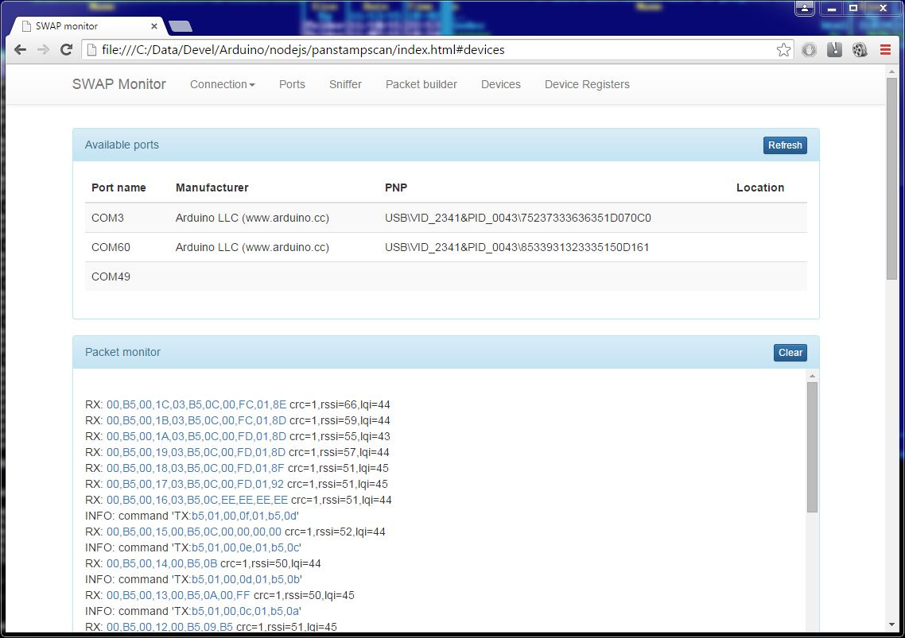
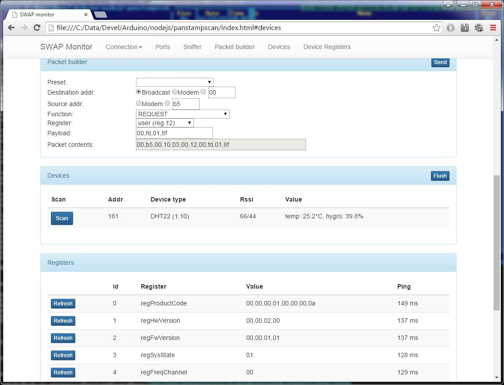
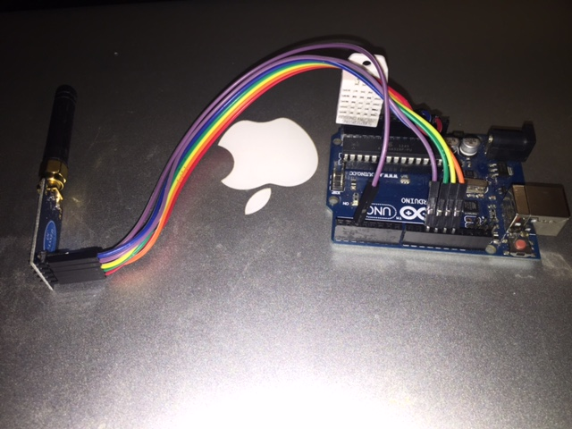
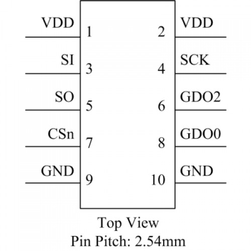

Panstamp swap
-----------------

Panstamp is a small arduino based wireless enabled module. It uses CC1101 configurable radio frontend. SWAP (Simple wireless abstract protocol) provides abstraction layer for communication with CC1101 radio. I tried to improve this protocol to support following features:
- Packet delivery information - Receiver notifies sender about successfull reception of packet, in case of transmission problems, it tries to resend the packet
- Mediator - this allow forming effective MESH netwoks or for accessing distant nodes
- Inquiry - scanning for modules in RX mode
- Modem mode - attach your panstamp module to PC and use SWAP network monitor for analysing or configuring your network 

SWAP monitor
-----------------
This utility communicates through virtual serial port with panstamp module which is running modem firmware. Monitor can be used for sniffing network traffic, configuring your devices... It is programmed as HTML webpage, you can open it in any webbrowser with websocket support. For accessing serial ports of your PC from javascript running in your browser, a server application was designed. For running this server application 'server.js' you will need NodeJs. It uses following libraries which you need to install by running 'npm install ...' command:
- serialport: for enumerating available serial pors and for communicating with them
- websocket: for creating local websocket server

Using SWAP monitor:
- download NodeJs
- go to folder where 'server.js' is placed
- execute 'npm install serial port'
- execute 'npm install websocket'
- execute 'node server.js'
- open 'index.html'

Features:
- Available ports - list of serial ports
- Packet monitor - here every received packet from MODEM is displayed, by clicking on the packet bytes, you send the packet to Packet builder
- Packet builder - can be used for creating and sending packets or for analysing packets from packet monitor
- Devices - shows all devices present on network and device data depending on swap device type
- Registers - shows all registers and values from selected swap device

Hw configuration
-----------------
For attaching CC1101 module to your arduino, you will need to wire up 7 signals:

| Signal        | CC1101 module pin | Arduino pin |       |
| :------------ | :---------------: | :---------: | :---- |
| VCC           | 1                 | 3.3V        |
| SI            | 3                 | 11          | spi
| SCK           | 4                 | 13          | spi
| SO            | 5                 | 12          | spi
| CSn           | 7                 | 10          | chip select
| GD0           | 8                 | 2           | interrupt on packet receive
| GND           | 9                 | GND         |

Module pinout:

Links:
-----------------
- http://www.panstamp.com/ - panstamp modules
- https://github.com/panStamp/panstamp/wiki - panstamp homepage
- https://github.com/panStamp/panstamp/wiki/SWAP-API - SWAP library documentation
- https://github.com/panStamp/swap - SWAP library code
