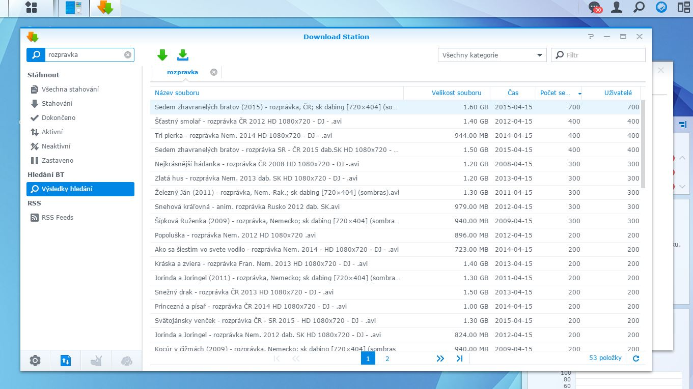

Ulozto.cz synology download station plugin
==========

This plugin allows you to directly download movies from ulozto.cz database from download station.

Requirements:
  - node js (can be downloaded in Synology Package Center)
  - request package "npm install request"

Installation:
  - Download Station -> Settings -> Searching BT -> Add service -> ulozto.dlm
  - Download Station -> Settings -> File hosting -> Add service -> ulozto.host
  - Copy /service files somewhere on your diskstation and start service from shell by typing "nodejs service.js", use "nohup" command for keeping it running even after disconnection from telnet. Refer to synology forums if you want to schedule this service to be started automatically at system startup...
  - Verify whether service is running by opening http://192.168.1.XXX:8034/ in your web browser

Features:
  - single click download
  - automatic captcha cracking
  - unlimited parallel downloads
  - rating score is displayed as number of peers by this equation "PEERS = 100 + rating*10". Rating 0 shows 100 peers, rating 1 as 110 peers ... rating 10 as 200 peers. Rating -1 as 90 peers, rating -5 as 50 peers...  
