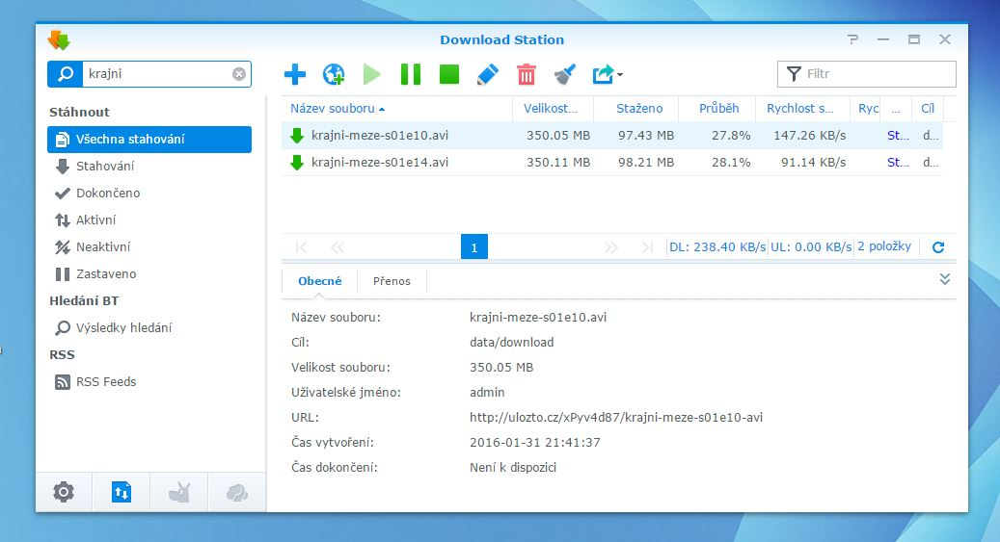

Ulozto.cz synology download station plugin
==========

This plugin allows you to search and download movies from ulozto.cz file sharing service directly from download station.

Requirements:
  - nodejs (can be downloaded in Synology Package Center)
  - request nodejs package "npm install request"

Installation:
  - Download Station -> Settings -> Searching BT -> Add service -> ulozto.dlm
  - Download Station -> Settings -> File hosting -> Add service -> ulozto.host
  - Copy /service files somewhere on your diskstation and start service from shell by typing "node server.js", use "nohup" command for keeping it running even after disconnection from telnet. Refer to synology forums if you want to schedule this service to be started automatically at system startup...
  - Verify whether service is running by opening http://192.168.1.XXX:8034/ in your web browser

Features:
  - single click download
  - automatic captcha cracking
  - unlimited parallel downloads
  - rating score is displayed as number of peers by this equation "PEERS = 100 + rating*10". Rating 0 shows 100 peers, rating 1 as 110 peers ... rating 10 as 200 peers. Rating -1 as 90 peers, rating -5 as 50 peers...  
  - automatic classification of download type depending on file extension

Todo list:
  - Rewrite captcha cracker into PHP, so nodejs service won't be necessary anymore

Stahovaci plugin ulozto.cz pre synology diskstation
==========

  1. **Instalacia search a host pluginu:** Pluginy pre download station tvoria dva subory - *ulozto.dlm* a *ulozto.host*. Instalujeme ich cez nastavenia v download statione - dlm plugin ulozime cez *nastavenia/hledani bt/pridat* a host plugin cez *nastavenia/hostovanie suborov/pridat*. Dolezite je tieto pluginy spravne stiahnut z githubu. Treba kliknut na ulozto.dlm a potom stiahnut kliknutim na tlacitko "raw", velkost suboru by mala byt 9.31kB a ulozto.host by mal mat 817 bajtov. Skontrolovat ci su spravne stiahnute sa da aj tak, ze ich skusis otvorit s WinRarom. Vovnutri je jeden subor "ulozto" a ked stlacis alt+v mal by ti ukazat konkretne zdrojove kody
  2. **Nakopirovanie skriptu:** Potrebujeme sa prihla na DSM cez sambu, (network sharing), tam si niekde vytvorit adresar napr. "uloztoservice" a tam skopirovat subory z adresara [SynologySearchEngine/Plugin/service](https://github.com/gabonator/Work-in-progress/tree/master/SynologySearchEngine/Plugin/service) (dokopy 7 suborov). Po prihlaseni na DSM cez telnet alebo ssh alebo putty prihlaseny na dsm, s pomocou prikazov "ls", "cd ..", "cd /", "cd", "pwd" sa dostan do adresara ktory si vytvoril. U mna je to "cd /volume1/shared/ulozto/service". Prikazom "ls" skontroluj ci tam naozaj je pritomny ten subor server.js.
  3. **Kontrola ci mas nainstalovany node js:** cez telnet zavolaj "node" a potom skus napisat "4+4" a malo by to vypisat hodnotu 8. Node vypnes ctrl+c, ctrl+c. Ak ho nemas nainstalovany, musis ist cez webove rozhranie do package managera (centrum balicku) a stiahnut balicek "node.js"
  4. **Spustenie skriptu:** ak sme v spravnom adresari so skriptom, a nodejs mame nainstalovany, zavolame "node server.js", pravdepodobne to napise error: "Cannot find module 'request'", ten doinstalujeme zavolanim "npm install request".
  5. **Otestovanie skriptu:** Otvor si http://diskstation:8034 cez webovy browser a skus nieco napisat do editboxu, mozes sledovat taktiez co robi konzola s beziacim servisom
  6. **Spustenie servisu v pozadi:** Ak ti server bezi, po odhlaseni z telnetu sa server vypne. Aby nam ostal bezat aj po odhlaseni, zavolame prikaz "nohup node server.js", samozrejme ze toto spustenie treba vykonat vzdy po restarte diskstationu, popripade to treba nejak nastavit aby sa to spustilo po starte

Mozne problemy:
  - Nemoznost pridat vyhladavaci plugin do download station - ak je subor ulozto.dlm alebo ulozto.host zle stiahnuty, download station ho odmietne nainstalovat. Skontroluj podla bodu 1
  - Ak download station stahuje podozrivo male, cca 40 kilobajtove subory, znamena to ze nebezi servis. Skontroluj podla bodu 5 a 6

Beta testing: 
  - Meenya