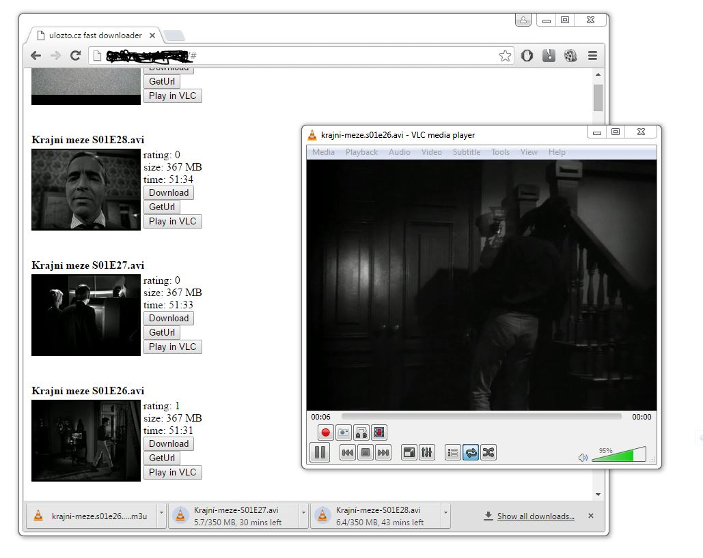
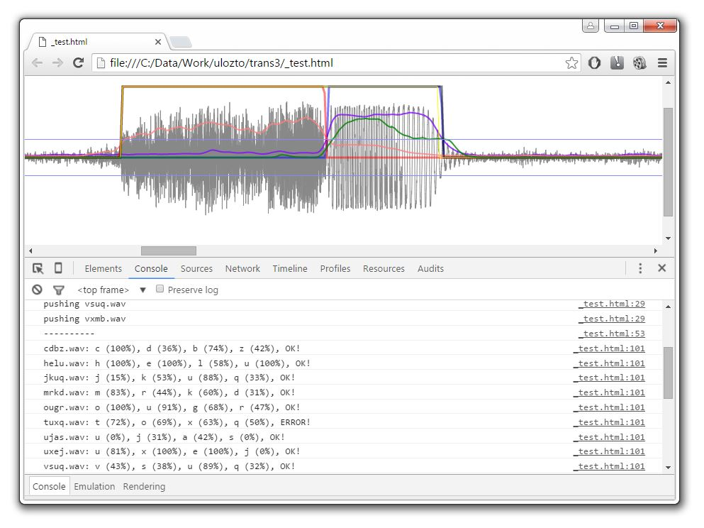

Ulozto.cz api
==========

Ulozto.cz is very popular file sharing service in Czech Republic and Slovakia. I visit this page mostly when I am looking for dubbed movies or fairy tales for children. This project aims to produce API for searching in ulozto databases. It is programmed in javascript (nodejs) and offers these services: 
 - suggestions by search term
 - detailed listing including movie length, file size, thumbnail, user rating
 - direct download link with automatic captcha analyser
 - unlimited concurrently downloaded files (at max. 300kBps)
 - direct streaming into VLC (or other player supporting m3u playlist)

Further goal is to rewrite this API into PHP so it could be used as custom Search Engine in Synology Disk Stations.

Interesting details about this API/ulozto.cz:
  - tools being used in this project: chrome (developer console), nodejs, curl, jsbeautifier
  - ulozto transfers search results as symetrically encrypted javascript code using [blowfish cipher](https://en.wikipedia.org/wiki/Blowfish_(cipher))
  - their javascript codes are lightly obfuscated and easy to turn into readable code (find&replace in text editor is sufficient)
  - during searching, ulozto creates a tons of connection to various advertisement, tracking and click collecting services - just see your network console in chrome and you will be surprised. Noscript & adblocker is a must for visiting this webpage
  - I was having troubles communicating with ulozto servers with nodejs.request library, even simple requests were failing and I was forced to use [curl] (http://curl.haxx.se/) commandline tool
  - The most difficult part was cracking captchas. I made small tool which automatically downloads captchas just to see how many unique images they have. After downloading 22000 captchas, sorting they by size I could easily see that there were many duplicates. Calculating hash of gif image wasn't enough. They append two random bytes at end of every captcha image :) By calculating hash of image data showed only 4000 unique images.
  - What to do with 4000 unique images? Surely I didn't want to spent so much time rewriting captchas by hand... There are some paid online services wich could be used, but I did not want to spend money on it. I couldn't find any opensource commandline tool for captcha decoding, so I decided to write my own captcha cracker from scratch.
  - Since I couldn't find any reliable image processing library for javascript, I tried to crack the audio captcha.
  - I was considering calculating spectrum [FFT](https://en.wikipedia.org/wiki/Fast_Fourier_transform) on isolated letters in recording and then locating most significant amplitude/frequency pairs
  - Initial experimets were done in Adobe Audition (getting spectral view of signal) and Adobe Photoshop (removing noise by applying curves on screenshot of spectral view). Audio captchas are encoded as 8bit WAV files at 16kHz samplerate.
  - After developing simple letter isolation algorithm I was surprised that calculating the duration of letter in samples was reliable enough to distinguish them :) Their captcha recordings used only one recording for each letter. Only the background noise was different in every recording. Not every, but I didn't count them
  - Instead of calculating FFT I decited to give it a try with calculating signal characteristics in time domain. From downloaded wave I separated low frequency signals, high frequency signals, calculated lp, hp, energy envelopes, measured their average value and variance and this set of information were used to numerically represent the recording
  - I initially feeded the learning algorithm with 20 recordings, then tried to crack 10 other captchas. Incorrectly cracked ones were added to the learning database and this procedure was repeated until it could convert 80% of random captchas
  - Learning algorithm refused to learn some captchas, then I realized they have wrong pairs of audio/image captcha in their database. For example one captcha had image 'HegJ' but in recording it was said 'htgj'. Many times the recording inccorectly contained 't' letter instead of 'e'... 

  - Currently the algorithm shows 80% success on cracking audio captchas. When it fails, it just tries to crack another captcha...

This screenshot show analysis of letter 's'. The first part shows dominance of high frequency components (red curve), where the second part has dominant low frequencies (blue curve). Green curve shows frequency of signal (ignoring noise). Low frequency and high frequency envelopes were used for calculation of signal extent. This was the key information for isolating the letter from background noise.
